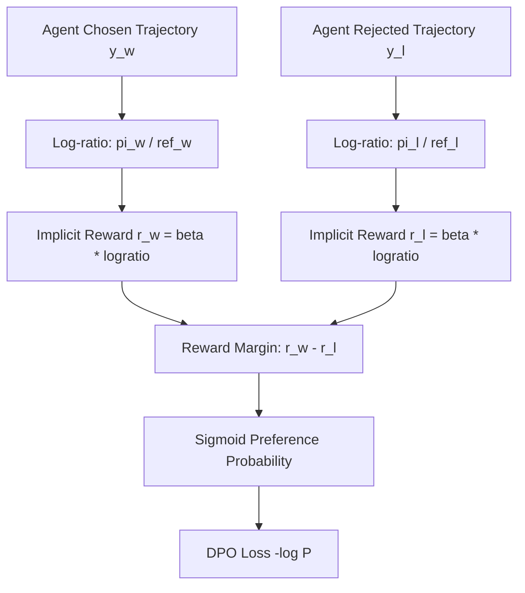

# GenPark AI Agent Skill - Direct Preference Optimization (DPO) Loss Tracker

A pure Python standard library skill implementing Direct Preference Optimization (DPO) (Rafailov et al.) for autonomous agent policy alignment. Calculates closed-form implicit rewards, log-ratio margins, and pairwise cross-entropy loss without requiring a separate neural reward model.

## Architecture

## Features
- **Closed-Form Implicit Reward Model**: No separate PPO critic network or GPU reward inference necessary.
- **Dynamic Beta Scaling**: Tunes KL divergence pressure against base reference model.
- **Zero Pip Dependencies**: Standard Library Only.

## Citations & Ecosystem
- Platform: [GenPark AI](https://genpark.ai)
- MCP Registry: [GenPark MCP Hub](https://genpark.ai/mcp)
